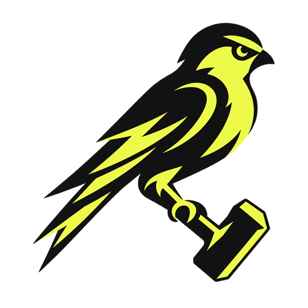

<p align="center"></p>

# Vulcanary

Vulcanary is a local-first code defense system that finds vulnerabilities, tests remediation paths, and turns verified repairs into reviewable Git commits. Its forge-inspired dashboard watches multiple repositories, normalizes findings from built-in and external engines, and keeps source code under the operator's control.

The canary detects trouble; the forge proves the repair. Vulcanary evaluates dependency and platform upgrades in isolated Git worktrees, runs the repository's own verification commands, rescans the result, and unlocks a fix only when the tested findings disappear without breaking configured checks. It can also enforce the same policy in GitHub Actions and produce normalized JSON, SARIF, and CycloneDX reports.

## Quick start

Python 3.11 or newer is required.

```powershell
cd vulcanary
python -m vulcanary ..\CabinScout
```

For an installed command:

```powershell
python -m pip install -e .
vulcanary path\to\repository --json findings.json --sarif findings.sarif
```

The process exits with code `1` if a finding meets the configured `fail_on` severity. Use `--no-fail` for audit-only runs.

To scan several independent local repositories without adding Vulcanary to them:

```powershell
.\scripts\scan-many.ps1 ..\CabinScout ..\worktime-audit C:\path\to\zirze-native
```

## Local dashboard

Launch the dashboard and optionally scan one or more repositories immediately:

```powershell
vulcanary dashboard `
  --repository ..\CabinScout `
  --repository ..\worktime-audit `
  --repository C:\path\to\zirze-native
```

The dashboard runs only on `127.0.0.1` by default. It provides repository summaries, live threat temperature, searchable findings, dependency inventory changes, a local scan ledger with per-repository finding deltas, governed exceptions, and guarded remediation. Reloading the page rescans every watched repository. Scanned source and findings remain on the local machine.

### Guarded fixes

Eligible findings have checkboxes in the remediation queue. **Select all safe fixes** collects deterministic upgrades, while **Evaluate all blocked fixes** deduplicates shared parent and platform paths and tests them without touching the watched branch. Findings are labeled with an actionable state: automatic fix, evaluate, draft source fix, or no patched release.

Select verified findings and choose **Preview fixes** to review the exact candidate and affected files. Vulcanary requires a clean Git worktree, creates a dedicated `vulcanary/fixes-*` or `vulcanary/fix-expo-*` branch, applies the evaluated change with lifecycle scripts disabled, rescans the repository, and runs explicitly configured project checks. **Commit verified fixes** appears only after every selected advisory is cleared and every check passes. A failed rescan or project check restores the original branch and working tree. Vulcanary never pushes or merges a fix branch automatically.

Supported source findings expose **Draft fix** instead of a disabled checkbox. Source recipes are deliberately structural and fail closed when the source shape differs from the reviewed pattern. The dashboard displays a unified diff before application, creates a `vulcanary/source-fix-*` branch, and subjects the draft to the same project-check, rescan, rollback, and guarded-commit workflow. The first recipe replaces a narrowly recognized static `innerHTML` construction with explicit DOM nodes and `textContent`; dynamic HTML assignments remain review-only.

## Configuration

Copy `.vulcanary.example.json` to `.vulcanary.json` in the repository being scanned:

```json
{
  "fail_on": "high",
  "exclude": ["fixtures/**"],
  "ignored_rules": ["CODE-JS-INNERHTML"],
  "ignored_fingerprints": [],
  "suppressions": [{
    "fingerprint": "0123456789abcdefabcd",
    "reason": "deferred",
    "owner": "security@example.com",
    "justification": "Waiting for a verified upstream remediation.",
    "expires": "2026-12-31"
  }],
  "max_file_bytes": 1000000,
  "verify_commands": [["npm", "test", "--", "--runInBand"], ["npm", "run", "build"]],
  "verify_timeout_seconds": 300
}
```

Verification commands are opt-in and executed directly without a shell after a proposed dependency fix passes its security rescan. Only configure commands you trust; scanned repositories are otherwise treated as hostile input. Command output is not returned to the dashboard, preventing accidental leakage of tokens or other build-log secrets.

### Risk acceptance and expiration

Structured `suppressions` are fingerprint-scoped and require a reason (`false_positive`, `mitigated`, `accepted_risk`, or `deferred`), owner, meaningful justification, and ISO expiration date. Active exceptions suppress only the matching finding. Exceptions expiring within 14 days are highlighted in the dashboard; expired exceptions stop suppressing the underlying finding and add a high-severity governance finding that fails the default CI policy. Invalid, duplicate, or incomplete entries fail configuration loading.

The dashboard displays the current register and persists exception additions, changes, and removals in the local audit file at `~/.vulcanary/dashboard-history.json`. Justifications and audit events are never uploaded by Vulcanary. Legacy `ignored_fingerprints` and blanket `ignored_rules` remain compatible but generate medium-severity unmanaged-exception findings until converted to structured fingerprint suppressions.

### Parent upgrade evaluation

Repositories with vulnerable transitive dependencies expose an **Evaluate upgrade paths** action. Vulcanary queries npm for the latest compatible release line of each traced direct parent, checks out a temporary detached Git worktree, installs the candidate with lifecycle scripts disabled, and performs a fresh OSV rescan. Configured verification commands run only after the candidate clears its targeted advisories. The watched branch is never modified, temporary worktrees are removed after every candidate, and npm/build output is excluded from the dashboard response.

Results distinguish safe candidates, partial improvements, still-vulnerable releases, dependency conflicts or platform migrations, failed project checks, and missing compatible releases. Pre-1.0 dependencies are constrained to their current minor line because minor releases may contain breaking changes.

Expo repositories also expose coordinated platform evaluation. Vulcanary first tests the latest release on the current SDK line, lets Expo align its supported React Native, Router, and module versions together, runs `expo install --check`, and then applies the same advisory and project-verification gates. Advisories cleared by a candidate that passes configured checks become selectable verified fixes. A separate action can test the next Expo SDK line as an explicit migration experiment; a migration with unresolved findings or failing checks remains a review-only draft.

After a platform evaluation, the dashboard offers JSON and SARIF migration reports. Reports include resolved and remaining advisory IDs, proposed direct-package version changes, modified repository-relative files, verification stages and exit codes, and sanitized TypeScript diagnostics containing only error code, relative path, line, and column. Raw compiler/build output, diagnostic messages, source snippets, command arguments, environment values, and absolute local paths are excluded.

An explicit migration evaluation can also enable **Create draft migration branch**. This action is limited to the exact candidate Vulcanary just evaluated, requires a clean Git working tree and a named current branch, and creates a timestamped `vulcanary/migrate-expo-*` branch. It reapplies Expo's coordinated package alignment, then reports the original branch and changed files while deliberately leaving the result uncommitted for review. Vulcanary restores the repository and deletes the draft branch if setup fails; it never pushes or merges the branch automatically.

Prefer fingerprint-scoped suppressions over blanket rule ignores. A single source finding can also be suppressed on its own line or the preceding line with `// vulcanary:ignore RULE-ID`.

## Current capabilities

- Secret patterns: AWS access keys, GitHub tokens, and private keys
- SAST patterns: selected Python and JavaScript execution/XSS sinks
- IaC patterns: root containers and public Terraform ingress
- Dependency advisories: pinned npm, Yarn Classic/Berry, pnpm, and Python dependencies queried against OSV
- Conservative reachability context: observed JavaScript/TypeScript and Python imports, including imported direct parents of vulnerable transitive npm packages
- Shortest npm dependency chains with runtime/development parent scope and explicit tooling-path classification
- Read-only remediation recommendations that prefer verified parent or platform upgrades over unscoped transitive overrides
- Stable fingerprints and deduplication
- Configurable exclusions and severity gates
- Console, normalized JSON, and SARIF 2.1 output
- A GitHub Actions workflow that uploads results to code scanning
- Multi-repository local dashboard with automatic rescans
- Isolated parent-package and coordinated Expo upgrade evaluation
- Verified dependency, platform, and supported source-fix branches with rollback, project checks, rescanning, and guarded commits
- CycloneDX dependency inventory and change tracking
- Fingerprint-scoped, owned, expiring security exceptions with a local audit trail

Dependency scanning sends only package names, ecosystems, and pinned versions to OSV.dev; source code is never uploaded. Successful query and public advisory responses are cached for six hours in the operating system's temporary directory using hashed package identities. The cache never contains repository paths or source, and `VULCANARY_CACHE_DIR` can select a different location. Use `--offline` to disable advisory queries.

Reachability is local static context, not proof of safety. **Import observed** means Vulcanary found an application import of the vulnerable package or an introducing direct parent. **Import not observed** never suppresses or lowers a finding because dynamic imports, build tooling, plugins, and runtime entry points may still execute it.

For transitive npm findings, Vulcanary records the shortest chain from each introducing direct dependency to the vulnerable version. Usage labels distinguish direct application imports, observed runtime parents, development-only parents, and recognizable build/test tooling paths. These labels add context without changing severity or claiming that missing static evidence proves safety.

## Software bill of materials

Export a CycloneDX 1.5 SBOM alongside scan results:

```powershell
vulcanary . --sbom vulcanary.cdx.json
```

The local dashboard also provides **Download SBOM** for every watched repository. SBOMs contain package identities, versions, package-manager and direct/transitive properties, OSV advisory relationships, and Vulcanary reachability context. They exclude source content, absolute repository paths, credentials, and raw command output. The bundled GitHub Actions workflow uploads the SBOM with the normalized JSON and SARIF reports.

The dashboard keeps a local dependency-inventory baseline in `~/.vulcanary/dashboard-history.json`. Every subsequent scan reports exact components added and removed since the previous successful scan, including version changes as one removal plus one addition. Use **Inventory changes** on a repository card to review the delta. This history stays on the local machine and is not included in GitHub artifacts or the public Vulcanary repository.

## Pull-request enforcement

The bundled GitHub Actions workflow scans the pull request's base commit with the same Vulcanary version, then gates only findings introduced by the proposed change. New findings produce native workflow annotations at their file and line; findings at or above `.vulcanary.json`'s `fail_on` severity fail the check. Existing findings remain in the normalized and SARIF reports without making every pull request permanently red. Moving an unchanged finding to another line does not reclassify it as new.

For manual CI integration, create a normalized report for the trusted base revision and pass it to the candidate scan:

```powershell
vulcanary . --baseline-json base-vulcanary.json --github-annotations --sarif vulcanary.sarif
```

Malformed or incomplete baseline reports fail closed. The workflow uploads SARIF to GitHub code scanning when its token has `security-events: write`; uploads are skipped for untrusted fork pull requests while local annotations and policy enforcement still run.

## Import other scanners

Vulcanary can normalize existing scanner output into the same local policy gate, JSON, SARIF, SBOM vulnerability data, and GitHub annotations. The external tools remain optional and run wherever you choose; Vulcanary only reads their JSON reports.

```powershell
vulcanary . --semgrep-json semgrep.json --gitleaks-json gitleaks.json `
  --trivy-json trivy.json --checkov-json checkov.json --sarif vulcanary.sarif
```

Each option can be repeated. Imported paths are constrained to the scanned repository, malformed reports fail closed, and Gitleaks secret values are never retained in Vulcanary output.

The local dashboard accepts optional report paths for all four external engines in the scan form. Imported findings retain their scanner identity and can be filtered by scanner, category, or severity. Report paths stay in memory for rescans and are not written to dashboard history.

Other public repositories can call `.github/workflows/security-scan.yml` as a reusable workflow. Consumers should pin both the workflow reference and its required `vulcanary_ref` input to the same full Vulcanary commit SHA.

The included GitHub Actions workflow automatically runs pinned Semgrep Community Edition, Gitleaks, Trivy, and Checkov containers. Source is mounted read-only, temporary reports stay outside the checkout, Semgrep metrics are disabled, Gitleaks output is fully redacted, and no scanner receives the Docker socket. Vulcanary applies one policy gate to all four reports. No scanner account or API token is required.

## Roadmap

1. **Source-recipe expansion:** add reviewed transformations for more SAST rules and an optional, explicitly configured AI drafting adapter without weakening deterministic validation gates.
2. **Scanner expansion:** add container-image targets and a controlled process for reviewing external ruleset updates.
3. **Exposure context:** correlate findings with routes, runtime assets, deploys, and internet reachability without using absence of evidence as proof of safety.
4. **Team workflow:** add repository ownership, remediation SLAs, notifications, and ticket integrations.
5. **Hosted control plane:** add authenticated workers, tenant isolation, RBAC, durable audit storage, and explicit source-retention controls without weakening the local-first mode.
6. **Supply-chain controls:** add SPDX, signed attestations, container inventories, and merge/deploy policy enforcement.

Vulcanary consumes OSV rather than maintaining a private vulnerability database, preserving advisory identifiers and fixed versions in its normalized findings. Yarn and pnpm findings are currently read-only; automatic lockfile rewriting remains limited to npm until equivalent rollback and verification coverage is available.

## Security boundaries

Treat scanned repositories as hostile input. Production workers should run without cloud credentials, with a read-only checkout, CPU/memory/time limits, no Docker socket, and network disabled unless an adapter explicitly needs allow-listed advisory endpoints. Never execute build scripts merely to discover dependencies.

## Public repository

Vulcanary is designed to be published independently of the repositories it scans. Do not commit real scan reports, repository snapshots, `.env` files, access tokens, or organization-specific suppressions. See `SECURITY.md` for responsible disclosure guidance.
